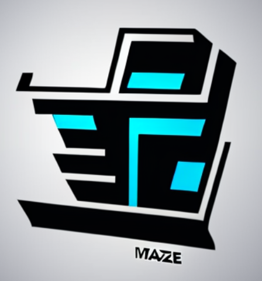

# Maze Game


<!-- logo y titulo -->
<div align="center">
  <a href="https://github.com/CS1103/proyecto-final-2023_0-proyecto-final-2023_0-grupo-3/blob/main/logomaze.png">
    
  </a>
  <h1> 	:robot:  EnigMaze 	:classical_building: </h1>
  
  <p>
   Hello World! Este proyecto es un juego sobre líos y enredos(Laberinto) desarrollado en C++.    
   Curso: Programación III, UTEC(Universidad de Ingenieria y Tecnología)  
   </p>
</div>

## Descripción del proyecto 

Maze Game es un juego de laberinto en el que el jugador debe usar su ingenio y habilidades para encontrar la salida lo más rápido posible.    
El objetivo final del juego es llegar a la meta, ubicada en el centro del tablero, antes que su oponente o la computadora, si se juega en solitario.   
Cada jugador comienza en un extremo opuesto del tablero y se turna para trazar su camino hasta la meta, buscando la mejor estrategia para alcanzar la victoria.   

## Características principales

### Características del juego
  - Experiencia única : El laberinto se genera aleatoriamente lo que significa que se tendrá diferentes estrategias para cada partida jugada.  
  - Bot: Se puede jugar en modo solitario, en el cual competirás contra un bot que pocas veces pierde.   
  - Juega con un amigo: Implementamos la opción de jugar 1vs1 (Local) en donde podrás contender a tus amigos.  

### Características técnicas:
 
  - **Singleton**  
    
    + Use el patrón Singleton cuando:  
       1) debe haber exactamente una instancia de una clase y debe ser accesible para los clientes desde un punto de acceso conocido.  
       2) cuando la única instancia debe ser extensible mediante la subclasificación y los clientes deben poder utilizar una instancia   
          extendida sin modificar su código.  (Gamma, Helm, Johnson, & Vlissides, 1995, p. 147).  

  - **Factory Method**    
      
     + Use el patrón Factory Method cuando:  
        1) Una clase no puede anticipar la clase de objetos que debe crear.  
        2) Una clase quiere que sus subclases especifiquen los objetos que crea.  
        3) Las clases delegan la responsabilidad a uno de varios subclases auxiliares, y se desea localizar el conocimiento de cuál   
           subclase auxiliar es el delegado.
 - **Builder**  
    

    + Use el patrón Builder cuando:
        1) El algoritmo para crear un objeto complejo debe ser independiente de las partes que componen el objeto y de cómo se ensamblan.
        2) El proceso de construcción debe permitir diferentes representaciones para el objeto que se construye.
     
  - **Adapter**  
    
    
    + Un adaptador envuelve uno de los objetos para esconder la complejidad de la conversión que tiene lugar tras bambalinas. El objeto envuelto ni siquiera es consciente de la existencia del adaptador. (Refactorin Guru)
 
  - **BRIDGE**  
    
    
  +  En este patrón, se crea una clase de abstracción que se conecta a una o varias clases de implementación mediante una interfaz común. De esta manera, se puede cambiar la implementación de una clase sin afectar a la abstracción.  

   
  - **Uso de DFS**  
    
      La búsqueda en profundidad (DFS) es una generalización del recorrido en preorden. Comenzando en algún vértice, v, procesamos v y luego recorremos recursivamente todos los vértices adyacentes a v. Si este proceso se realiza en un árbol, entonces todos los vértices del árbol se visitan sistemáticamente en un tiempo total de O(|E|), ya que |E| =  Θ(|V|). (Weiss, 2014)
      
  - **Uso de BFS**  
      
    Al igual que DFS, BFS recorre un componente conectado de un grafo y, al hacerlo, define un árbol de expansión útil. En lugar de buscar recursivamente, sin embargo, BFS procede en rondas y subdivide los vértices en niveles, que representan el número mínimo de aristas desde el vértice de inicio a cada vértice. Goodrich and Tamassia (2022) 
  - **Uso de mecanismo BodyBlock**   
  
   
    Consiste en bloquear el movimiento de un personaje enemigo con el propio cuerpo. Esto se logra posicionándose estratégicamente frente al enemigo y bloqueando su camino, lo que impide que el enemigo pueda avanzar o retroceder libremente.  
    Esto lo usamos para añadir un mecanismo que favorezca la interacción entre los jugadores, lo que hace que sea más emocionante cada partida en nuestro laberinto.
  
### Estructuras de datos usadas

  - Vector
  
  Los vectores son contenedores secuenciales que encapsulan a los arrays de tamaño dinámico.
  
  
  
  - Mapa
  
  Los mapas son contenedores asociativos que almacenan elementos formados por la combinación de un key (identificador del elemento) y un value (contenido asociado), siguiendo un orden específico.
  
  

  - Pair

  Los pairs son contenedores usado para almacenar dos elementos (que pueden ser de distintos tipos) como una sola unidad.

  

  - Set
  
  Los sets son contenedores asociativos que almacenan elementos únicos siguiendo un orden específico.
  
  
  
  - Queue
  
  Las colas son adaptadores de contenedores que operan en la disposición FIFO. Los elementos se insertan desde el final y se eliminan al inicio de la cola.
  
  
  
  - Grafo

  Los grafos son composiciones de nodos que se relacionan a través de conexiones llamadas aristas. Nos permiten visualizar las relaciones de distintos elementos.

  


## Requisitos
  - Sistema Operativo Windows   
  - Compilador de codigo C++ para Windows (gcc, g++, etc)
  - CMake (si piensa usar el codigo fuente)

## Guía de instalación     
Este juego fue probado en las computadoras con el sistema operativo *Windows 10-11*.    
¿Pasos a seguir?  

1. Clonar el repositorio del proyecto en GitHub

```bash
git clone https://github.com/CS1103/proyecto-final-2023_0-proyecto-final-2023_0-grupo-3.git
```

## Instrucciones o reglas de uso   
1) Escoge el tamaño del laberinto que vas a jugar, tienes 2 opciones (15x21 y 30x42)  
2) Digita la modalidad a jugar. Tienes 3 opciones (Jugador vs Jugador, Jugador vs Bot, Bot vs Bot)  
3) El movimiento del juego es desde una coordenada hasta una coordenada de intersección de 2 o más caminos.    
    PD: Si eres hábil puedes bloquear el paso del otro jugador, diviertete!  
4) El juego termina cuando se llega al premio que está en las coordenadas centrales.


## Licencia de uso 

Distribuido bajo la licencia MIT. Ver [`LICENCE`](LICENCE) para más información.

## Diagramas  


# **The end...**


## Autores  

- Cordova Flores, Salvador Justo Ruben
- Jimenez Condori, Joel Gladimir
- Rivera Olaza, Abel Jaime
- Salhua Vicuña, Alex Rodrigo
- Tabraj Morales, Sebastian
- Wong Orrillo, Jose Francisco

## Bibliografía  
Referencias de las imagenes a la pagina de IA
- Refactoring Guru. (s. f.). Refactoring Guru: Diseño de código. Recuperado de https://refactoring.guru/es
- Canva. (s. f.). Diseño gráfico y programación visual. Recuperado de https://www.canva.com/
- DeepAI. (s. f.). Imagen generada por Text2Img. Recuperado de https://deepai.org/machine-learning-model/text2img
- Encora. (2021, 21 de junio). DFS vs BFS. Encora Blog. https://www.encora.com/es/blog/dfs-vs-bfs
- Gamma, E., Helm, R., Johnson, R., & Vlissides, J. (1995). Design Patterns: Elements of Reusable Object-Oriented Software. Addison-Wesley Pub Co.
- Weiss, M. A. (2014). Data Structures and Algorithm Analysis in C++. Pearson Education.
- Goodrich, M. T., & Tamassia, R. (2022). Algorithm Design and Applications (7th ed.). John Wiley & Sons, Inc.
